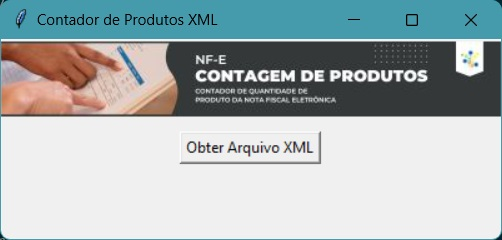

# Contador de Produtos XML

## Descrição

O Contador de Produtos XML é um aplicativo que permite calcular a soma da coluna qCom de um arquivo XML de Nota Fiscal Eletrônica (NF-e).

Este contador foi elaborado para solucionar a questão decorrente da chegada de mercadorias em lojas com múltiplos volumes. Em certos casos, notas de grandes volumes não apresentavam o campo de quantidade total, o que demandava a contagem individual das linhas para verificar as caixas.

## Tecnologias Usadas

- **Python**: Linguagem de programação utilizada para desenvolver o aplicativo.
- **Tkinter**: Biblioteca gráfica do Python para criar interfaces de usuário.
- **PIL (Python Imaging Library)**: Biblioteca Python para abrir, manipular e salvar muitos formatos de imagem diferentes.

## Funcionalidades

- Permite ao usuário selecionar um arquivo XML de NF-e.
- Calcula a soma da coluna qCom (quantidade comercial) dos itens presentes no arquivo XML.
- Exibe o resultado da soma da coluna qCom ao usuário.

## Configuração e Execução

### Pré-requisitos

- Python instalado na máquina.

### Instalação

1. Clone o repositório para sua máquina local:

git clone https://github.com/leandrotobita/appcontadornfe.git

2. Navegue até o diretório onde o código está localizado:

cd appcontadornfe

3. Instale as dependências necessárias usando o seguinte comando:

pip install Pillow

4. Execute o código Python:

python contador_nfe.py

